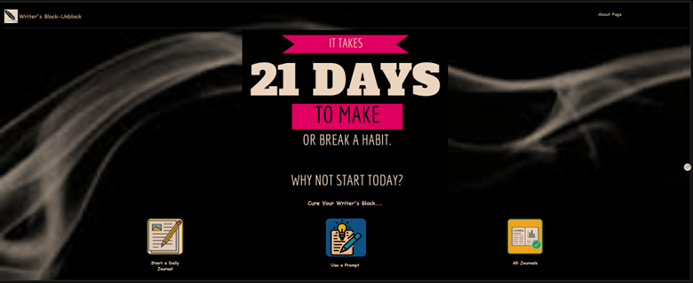

Introduction:

As a creative writer and an emerging software engineer, I attempted to create a writing app to help writers deal with writer’s blog. 

The app has a create journal page, which contains a template of the same questions for writers who want to start somewhere or want some motivation to begin writing.

It has a prompts page that utilizes a random topic generator for writers who are struggling to come up with an idea.

It also features an all-Journals page for writers to track their writing progress, edit, and update their posts.

I watched various tutorials and sought help from experienced software developers to get to this point. 
In addition to the class tutorials, these are some of the tutorials I used:

https://www.youtube.com/watch?v=ACNGhBfNftA&list=PLgp11Hu-N4DT59rXjR57hhy6pMH3I2yHU
https://www.youtube.com/watch?v=KtnHb7FMk2Q&list=PLp50dWW_m40Vruw9uKGNqySCNFLXK5YiO

Technologies Used:
-  For my Frontend/client, I used:
  - React
  - Ajax for API communication
  - UID for generating unique post IDs

Getting Started:

Project Planning: To get started, I used Figma to create some wireframes of what I thought it should look like:
https://www.figma.com/file/uQu10qVwoDOf0Z2WRVkmoA/Writersblockunblock?type=design&node-id=0-1&mode=design&t=LK60ON3xR0xqsemP-0

Unsolved Problems: 

One of the biggest challenges I have had has been using ajax to fetch data from the server.
I managed to use it to finish this project somehow, but I’ll visit Ajax after this project.
I was also unable to find APIs to generate random topics, so I ended up using one that generates random dad jokes, to fulfil the requirement of including a secondary API.

Future Enhancements:
I am turning this app into a full blog with more functional pages that can be used by other writers.
Find more organic pictures, instead of stock images.
Rewrite the style sheets so I don’t have so many stylings that could have been grouped together.
Find or build an API that generates a random topic for writers.

Attempt to use Axios, instead of Ajax. 
I stumbled on Axios while creating this project, and it seemed easier to use than Ajax.

Contribution:
To contribute to this project or create your own writing app from this,
Have:

 Node.js, npm, and depencies installed on your machine.
- MongoDB installed and running locally or on a remote server.

-Clone this repository:
You’re ready to work.